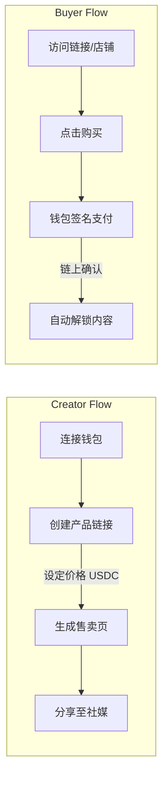
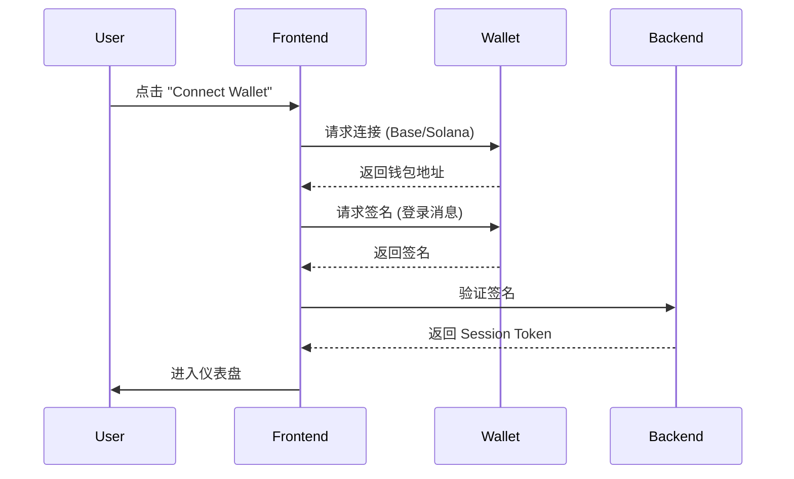
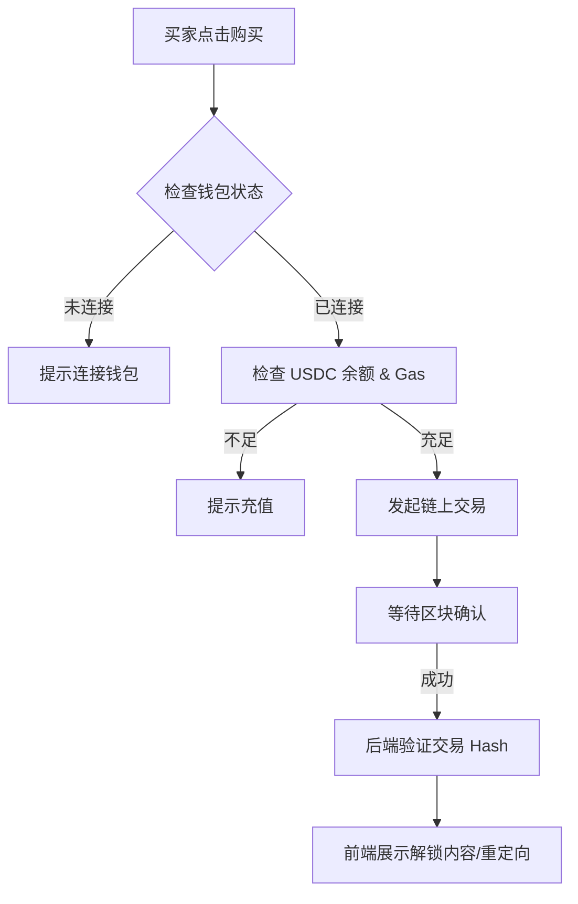

# 1ly.store 模式产品需求文档 (PRD)

## Requirement Overview
构建一个基于 Web3 的极简数字商品变现平台，旨在让创作者通过“单一链接”即时出售数字资产（文件、API 访问权限、私密链接）。核心价值是**零摩擦**：卖家仅需连接钱包即可发布，买家支付 USDC 后自动获得访问权限，无需注册账户。

## Requirement List
1. **Wallet-First Authentication**: 支持多链钱包连接（EVM/Solana），以此作为唯一身份标识。
2. **Link-to-Product Creation**: 极简发布流程，将目标 URL 包装为付费资产。
3. **Unified Storefront**: 自动生成创作者个人主页，聚合所有在售商品。
4. **Cross-Chain Payment Gateway**: 支持 Base 和 Solana 链上的 USDC 支付与结算。
5. **Instant Delivery System**: 支付成功后的自动化内容交付与访问控制。

## Detailed Design

### Module 1: Wallet-First Authentication (身份认证)
**Logic Flow:**

**Interaction Points:**
*   **登录页**: 仅展示 "Connect Wallet" 按钮，无邮箱/密码输入框。
*   **钱包选择器**: 支持 MetaMask, Coinbase Wallet, Phantom。
*   **自动识别**: 根据用户上次连接的链，优先展示对应钱包选项。

**Acceptance Criteria:**
*   [ ] 能够成功连接 EVM (Base) 和 Solana 钱包。
*   [ ] 后端能够通过签名验证用户身份并创建/关联账户。
*   [ ] 登出后清除本地 Session。

---

### Module 2: Link-to-Product Creation (产品发布)
**Logic Flow:**
用户输入目标 URL -> 系统抓取元数据（可选） -> 用户设定价格 -> 生成支付网关链接。

**Interaction Points:**
*   **新建页面**: 
    *   输入框: `Target URL` (例如 Google Drive 链接, Notion 页面)。
    *   输入框: `Price (USDC)`。
    *   输入框: `Product Name` & `Description`。
    *   开关: `Limit Quantity` (可选，限制售卖份数)。
*   **预览卡片**: 实时展示在店铺中显示的样子。

**Acceptance Criteria:**
*   [ ] 必填项校验（URL 格式，价格 > 0）。
*   [ ] 发布成功后生成唯一的短链接（如 `1ly.store/user/item-id`）。
*   [ ] 支持对 URL 进行混淆加密存储，确保仅在支付后解密。

---

### Module 3: Unified Storefront (个人店铺)
**Visual Design Highlights:**
*   布局：极简网格布局，顶部为创作者头像与简介。
*   卡片：每个商品展示标题、价格、简介缩略。

**Logic Flow:**
访问 `domain.com/username` -> 加载该钱包地址下的所有公开商品 -> 点击跳转至详情/支付页。

**Acceptance Criteria:**
*   [ ] 页面加载速度 < 1s（静态化处理）。
*   [ ] 支持移动端自适应（Mobile First）。
*   [ ] 买家无需登录即可浏览所有商品。

---

### Module 4: Cross-Chain Payment & Delivery (支付与交付)
**Logic Flow:**

**Interaction Points:**
*   **支付模态框 (Modal)**: 展示支付金额、Gas 预估、目标网络。
*   **状态反馈**: 
    *   Pending: "Confirming on chain..." (带加载动画)。
    *   Success: "Purchase Complete! Redirecting..."。
*   **交付页**: 显示被隐藏的链接或直接触发下载/跳转。

**Acceptance Criteria:**
*   [ ] 支持 Base 链 USDC 支付。
*   [ ] 支持 Solana 链 USDC 支付。
*   [ ] 交易确认后 3 秒内自动解锁内容。
*   [ ] 防止重放攻击（每个 Tx Hash 只能使用一次）。

## Edge Cases
| Scenario | Trigger Condition | Handling | Fallback |
|---|---|---|---|
| **交易失败** | 用户拒绝签名或链上 Gas 不足 | 模态框显示 "Transaction Failed" 并保留在支付页 | 允许用户重试或切换钱包 |
| **支付超时** | 链上拥堵导致长时间未确认 | 显示 "Waiting for confirmation..." 并提供手动刷新按钮 | 后端定时轮询链上状态 |
| **链接失效** | 卖家源文件链接已删除 (404) | 买家支付后无法访问内容 | 提供 "Report Issue" 按钮，通知平台介入 |
| **非 USDC 支付** | 用户试图用 ETH/SOL 支付 | 前端强制限制仅接受 USDC 合约交互 | 禁用支付按钮直至切换到正确代币 |

## Data Specification
**Key Metrics (KPIs):**
1.  **TVL / GMV**: 平台总交易额 (Total Volume)。
2.  **Conversion Rate**: 访问详情页 -> 点击购买 -> 支付成功的转化漏斗。
3.  **Wallet Connection Rate**: 访客连接钱包的比率。
4.  **Creator Retention**: 每月发布至少 1 个新商品的创作者比例。

**Tracking Points:**
*   `event: wallet_connect` (provider, chain_id)
*   `event: product_create` (price, category)
*   `event: checkout_start` (product_id, price)
*   `event: transaction_complete` (tx_hash, network, amount)